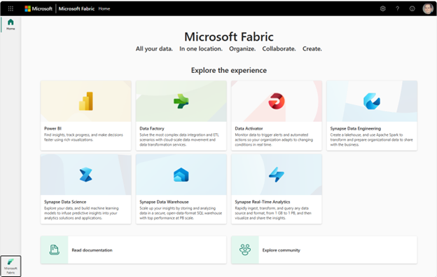

# Introducing Microsoft Fabric: The All-in-One Analytics Solution

### **Getting Started**

1.	In a web browser, navigate to [Microsoft Fabric](https://fabric.microsoft.com). 
2.	Login and show the landing page which shows the different experience.

<br>

&ensp; &ensp; &ensp; &ensp; 

<br>

3.	Select data engineering or data warehouse experience.
4.	Create a new workspace.

### **Lakehouse**

1.	Create a new lakehouse called **WideWorldImportersLH**.
2.	Upload the **sale.parquet** file.
3.	Convert the file into a table.
4.	Create a quick report from the lakehouse’s default dataset.
5.	Show OneLake file explorer and upload the **customer.parquet** file. 
6.	Show the notebook experience to convert the file into a table.<br>**Replace the Workspace ID, Lakehouse ID, and the file directory in the code snippet.**

<br>

```python 
df = spark.read.parquet("abfss://{Workspace ID Here}@ onelake.dfs.fabric.microsoft.com/{Lakehouse ID Here}/Files/{Optionally, Directory Here}/customer.parquet")

df.write.format("Delta").save("Tables/customer")
```

<br>

7.	Create relationship in the data model from sale to customer.
8.	Build dataflow to load Dataflow Customer.csv to the lakehouse.
    1. Drag + drop upload the file.  
    2. Filter the top 3 rows.
    3. Promote first row to headers.
    4. Split the location field by comma (city, state, country).
    5. Filter the country to US only.
    6. Remove the country field. 
    7. Rename the city and state fields. 
    8. Set the destination to a new table in the lakehouse.
9.	Show creating a shortcut to an ADLS account. 
    1. https://<mark>**{Account Name Here}**</mark>.dfs.core.windows.net
    2. <mark>**Choose any container**</mark>

### **Warehouse**
1. Create a new warehouse called WideWorldImportersDW.
2. Create a pipeline to copy data from the **WideWorldImportersDW.Dimension.StockItem** table in Azure SQL DB to the **dbo.StockItem** table in the warehouse.
3. Show connecting to the database with Azure Data Studio (or SSMS). 
4. Run a few queries and show the cross database query functionality. 

<br>

```sql
SELECT TOP 100
    s.InvoiceDateID,
    Region,
    s.Subregion,
    s.SalesTerritory,
    i.StockItem,
    i.Size,
    i.Brand,
    c.Customer,
    c.Category AS CustomerCategory,
    c.BuyingGroup,
    c.PostalCode,
    s.Quantity,
    s.Profit,
    s.TotalPrice
FROM WideWorldImportersLH.dbo.sale AS s
INNER JOIN dbo.StockItem AS i
    ON s.ItemID = i.StockItemKey
INNER JOIN WideWorldImportersLH.dbo.customer AS c
    ON s.CustomerID = c.CustomerID
WHERE
    i.StockItem LIKE '%pizza%'

SELECT
    s.Region,
    s.Subregion,
    s.SalesTerritory,
    i.StockItem,
    SUM(s.Quantity) AS TotalQuantity,
    SUM(s.Profit) AS TotalProfit,
    SUM(s.TotalPrice) AS TotalPrice
FROM WideWorldImportersLH.dbo.sale AS s
INNER JOIN dbo.StockItem AS i
    ON s.ItemID = i.StockItemKey
INNER JOIN WideWorldImportersLH.dbo.customer AS c
    ON s.CustomerID = c.CustomerID
WHERE
    i.StockItem LIKE '%pizza%'
GROUP BY
    s.Region,
    s.Subregion,
    s.SalesTerritory,
    i.StockItem

SELECT
    CONCAT(d.CalendarYear, '-', RIGHT(CONCAT('0', d.CalendarMonthNumber), 2)) AS YearMonth,
    s.Region,
    s.Subregion,
    s.SalesTerritory,
    i.StockItem,
    SUM(s.Quantity) AS TotalQuantity,
    SUM(s.Profit) AS TotalProfit,
    SUM(s.TotalPrice) AS TotalPrice
FROM WideWorldImportersLH.dbo.sale AS s
INNER JOIN dbo.StockItem AS i
    ON s.ItemID = i.StockItemKey
INNER JOIN WideWorldImportersLH.dbo.customer AS c
    ON s.CustomerID = c.CustomerID
INNER JOIN WideWorldImportersLH.dbo.date AS d
    ON s.InvoiceDateID = d.Date
WHERE
    i.StockItem LIKE '%pizza%'
GROUP BY
    s.Region,
    s.Subregion,
    s.SalesTerritory,
    i.StockItem,
    d.CalendarYear,
    d.CalendarMonthNumber
```
